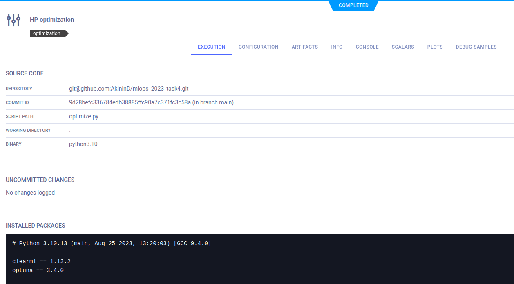

# mlops_2023_task4
# Оптимизация Гиперпараметров с использованием ClearML

## Описание Проекта

Проект по оптимизации гиперпараметров для модели классификации на основе конволюционной нейронной сети. 
Модель обучается на рентгенографических снимках грудной клетки с целью классификации на три класса: 
"норма", "бактериальная пневмония" и "вирусная пневмония". Использовался небольшой датасет: 206 (train) и 45 (val) 
изображений, при этом классы сбалансированы по числу изображений, по этой причине accuracy использовалась как основная метрика.

## Инструменты

- **Optuna** для подбора оптимальных гиперпараметров.
- **ClearML** для оркестрации и мониторинга процесса обучения.

## Гиперпараметры для оптимизации

- `lin1_size`: размер первого полносвязного слоя (диапазон: 64-128).
- `lin2_size`: размер второго полносвязного слоя (диапазон: 32-64).
- `p_dropout`: вероятность dropout (диапазон: 0.0-0.4).
- `lr`: скорость обучения (логарифмический диапазон: 10<sup>-3</sup>-10<sup>-1</sup>).
- `batch_size`: размер батча (варианты: 2, 4, 8).

## Используемая метрика

Метрика, использованная для оптимизации, - **точность классификации (accuracy)** на валидационном наборе данных.

## Скриншоты ClearML

1. **Динамика Обучения**. Эксперимент с лучшим результатом, демонстрирующий изменение `Training Loss`, `Validation Loss` и `Validation Accuracy` в течение эпох обучения.
 
2. **Список задач (Task)**. Список задач, в которую входит задача оптимизации (тип Optimizer), и дочерние эксперименты обучения (тип Training).
 
3. **Задача Optimizer**. Описание задачи оптимизации (Optimizer).
 
4. **Диаграмма Parallel Coordinates**. Визуализирует и сравнивает результаты множества экспериментов, отображая как изменение гиперпараметров влияет на ключевые метрики производительности модели.
 
5. **Итоговая таблица**. Таблица показывает эксперименты с лучшей точностью на валидационных данных, выделяя 10 наиболее эффективные комбинации гиперпараметров.
 

## Заключение

Лучше гиперпараметры:
```
batch_size=8
lin1_size=64
lin2_size=48
lr=0.0022
p_dropout=0.3
```
Исходя из анализа параллельной диаграммы, можно выделить наиболее влиятельные гиперпараметры на точность модели:
* Вероятность дропаута: наблюдается тенденция, что более высокая вероятность дропаута способствует улучшению точности.
Это может быть связано с размером датасета: при небольшом количестве данных дропаут помогает предотвратить переобучение.
* Размер шага обучения (learning rate): более низкий размер шага обучения показывает лучшие результаты, что указывает на
необходимость более тонкой настройки весов модели. Высокий шаг обучения может привести к нестабильности в процессе обучения
и риску переобучения, особенно в условиях ограниченных данных.